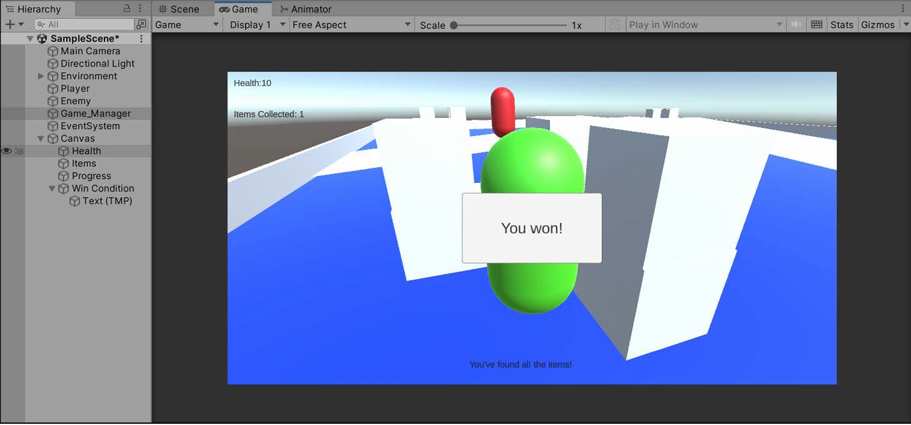
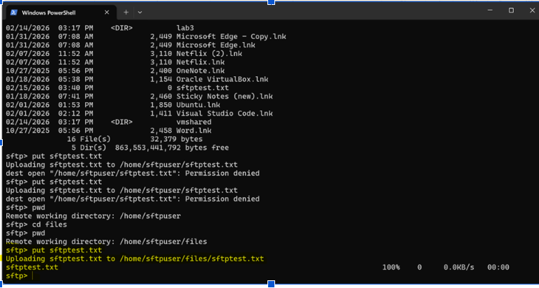

# Kyrstin Jenkins

## Cybersecurity Student | IT Professional

CSCI 496: Senior Portfolio  
In partial fulfillment of the requirements for the degree of Bachelor of Science in Cybersecurity  

---

## About Me
I am currently a senior at Charleston Southern University pursuing a degree in Cybersecurity. I work full-time in IT and have hands-on experience with networking, system security, and troubleshooting. I have earned my CompTIA Network+ certification and I am currently preparing for the Security+ exam.

---

## Programming Projects

### [Jumpy Block | CSCI 432](project1.md)

A Unity 3D endless runner game where the player controls a block that automatically moves forward and must jump over obstacles. The game includes increasing difficulty, score tracking, and dynamic gameplay.

---

### [SFTP Server Project | CSCI 352](project2.md)

Configured a secure file transfer server using SSH to safely transfer files between systems. This project focused on security, authentication, and system configuration.

---

### [PHP Registration System | CSCI 315](project3.md)

Developed a web-based registration system using PHP that stores user data in structured files. Implemented input validation and basic security features.

---

## Ethics Papers

### Paper 1: (Racial Discrimination and the Death Penalty in the United States)
- Class: (CRIM 210)  
- Grade: (75)  
- [View Paper](pdf/paper1.pdf)

---

### Paper 2: (Ethics Paper)
- Class: (CSI 419 Database Management)  
- Grade: (80)  
- [View Paper](pdf/paper2.png)

---

### Paper 3: (The Ethical Implications of AI on Game Development)
- Class: (CSI 419 Database Management)  
- Grade: (93)  
- [View Paper](pdf/paper3.png)

---

## Presentations

### Network Security Presentation | CSCI 352
- Grade: (100)  
- [View Presentation](pdf/presentation1.pdf)

---

### Cybersecurity Project Presentation | CSCI 419
- Grade: (95)  
- [View Presentation](pdf/presentation2.pdf)
